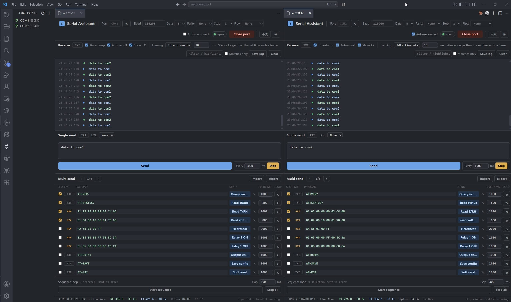

# Serial Tool

在 VS Code 里收发串口数据。**一个面板 = 一条会话 = 一个端口**——想同时盯两块板子，
就开两个面板各连一个口，互不干扰。

## 上手

点左侧活动栏的 🔌，端口列表里**点一个就直接连上**。插拔设备列表会自己刷新。

已连接的口标成绿色，点它是切到对应面板而不是再开一个；同一个口想再开一个面板，
用行尾的 `+`。其余入口：状态栏的 `🔌 串口`、串口面板标题栏的 `+`、命令面板的
「新建串口面板」/「串口面板…」。

## 能做什么

- HEX / 文本双视图，时间戳、自动滚动、过滤高亮、日志导出
- 周期发送、多条预设与顺序循环、CRC / SUM / XOR 校验和
- 按空闲超时 / 行尾 / 原始字节分帧，断线自动重连
- 端口被别的面板占着时直接拦下并说明原因，而不是一句 `Failed to open serial port`
- **串口连接活在扩展宿主进程里**：面板被隐藏、切去看代码都不会断，周期发送照跑
- 设备身份带序列号，换个 USB 口插也认得出来，波特率和备注跟着设备走
- 设置存在 VS Code 的 globalState，可随 Settings Sync 跨机器同步

## ⚠️ 发出去的字节有物理后果

- 内容或波特率写错可能刷坏固件；报文可能触发继电器、电机、气缸等机械动作
- **周期发送会一直发下去**，包括你切走标签页、隐藏面板之后——这是设计如此
- 在 ESP32、带自动下载电路的 Arduino 等板子上，**仅仅「打开端口」这个动作**
  就会通过 DTR/RTS 触发复位

请只在你有权操作的设备上使用。本工具按「现状」提供，不作任何担保。

## 已知限制

远程开发（SSH / WSL / 容器）时，打开的是**扩展宿主所在那台机器**的串口。

## 另有网页版

同一套核心与界面的纯网页版：<https://serial.uplume.com/>，Chromium 系浏览器打开即用，
不需要安装任何东西。

## 许可证

[MIT](LICENSE)
